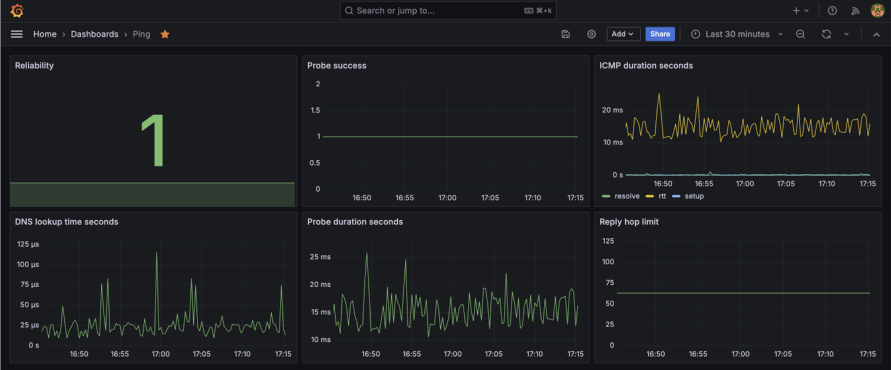
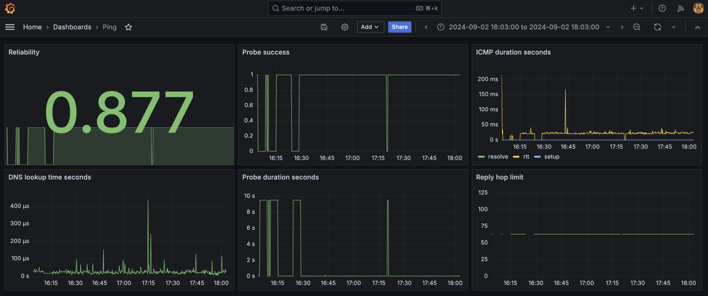

# Ping Monitoring Dashboard 📊

My ISP didn't believe me that my internet connection was unreliable, so I created this dashboard using **Docker, Grafana, and Prometheus** to monitor my connection and provide hard data.

## Overview

The dashboard is designed to help monitor the network reliability and latency of ping requests using Prometheus and Grafana. It includes multiple metrics that provide insight into ping response times, success rates, and additional diagnostic data. 

## Screenshots

Two example screenshots are included to illustrate the behavior of the dashboard under different network conditions:

### Good Scenario

The `good.png` screenshot (located in `screenshots/good.png`) represents a situation where the network is stable, with high reliability and low ICMP duration. Most ping probes succeed, with consistent round-trip times.

### Bad Scenario (real example 😬)

The `bad.png` screenshot (located in `screenshots/bad.png`) shows a situation where there are network issues, resulting in lower reliability and fluctuating ICMP duration. Some ping probes fail, and response times vary greatly.

### Key Metrics

- **Reliability**: Displays the overall success rate of the ping probes, showing how reliable the network is over a period.
- **Probe Success**: Indicates whether the ping probes successfully reached the target server.
- **ICMP Duration Seconds**: The round-trip time (RTT) in milliseconds for ICMP ping packets.
- **DNS Lookup Time**: Time spent on DNS lookups, which is measured in microseconds.
- **Probe Duration Seconds**: The total time it takes for the ping probe to complete.
- **Reply Hop Limit**: Displays the time-to-live (TTL) of the ping reply packets, indicating how many hops the packet took.

## Getting Started

To recreate this dashboard using Grafana and Prometheus:

1. Ensure you have Docker installed and running on your system.
2. Run `docker-compose up -d` from this directory.
3. Open [http://localhost:3000/d/cdwor2stprugwd/ping?orgId=1](http://localhost:3000/d/cdwor2stprugwd/ping?orgId=1) to view the dashboard.

Run `docker-compose down` to stop the containers when you're done. You can also clean up the volumes by running `docker-compose down -v`.

## License

This project is licensed under the MIT License. See the [LICENSE](LICENSE) file for details.
